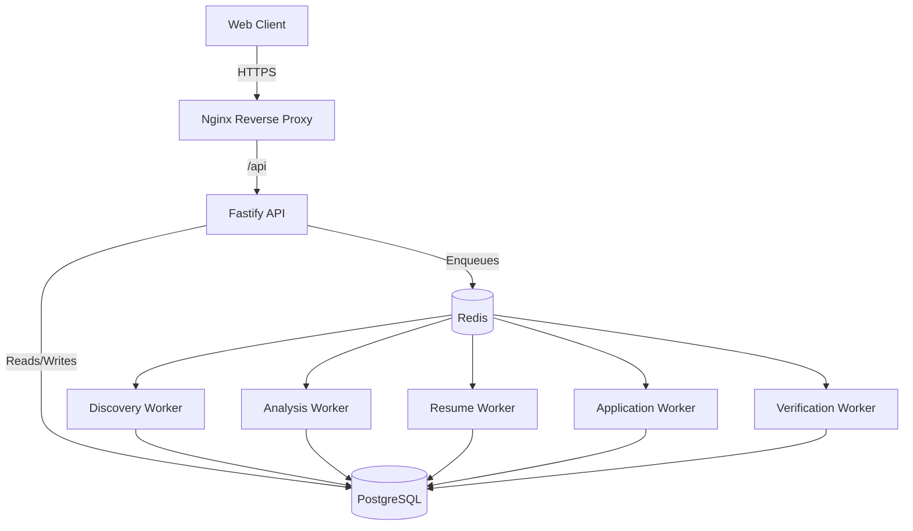

# Architecture Documentation
## System Architecture Diagram

```mermaid
graph TD
    A[Web Client] -->|HTTPS| B[Nginx Reverse Proxy]
    B -->|/api| C[Fastify API]
    C -->|Reads/Writes| D[(PostgreSQL)]
    C -->|Enqueues| E[(Redis)]
    E --> F[Discovery Worker]
    E --> G[Analysis Worker]
    E --> H[Resume Worker]
    E --> I[Application Worker]
    E --> J[Verification Worker]
    F --> D
    G --> D
    H --> D
    I --> D
    J --> D
```
